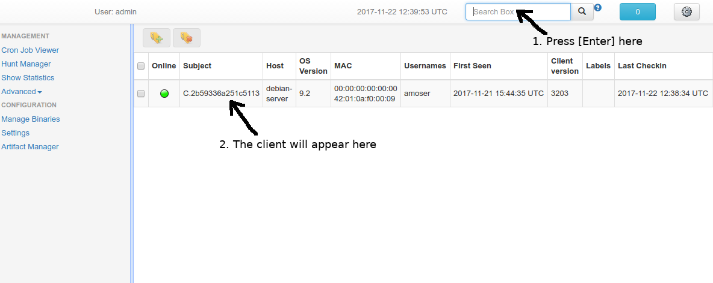

# How to check if a deployed client talks back to the GRR server

If a client installation is successful, the client should appear in the web UI search within a
few seconds.

After install, hit Enter in the search box in the top left corner of the
UI to see all of your clients that have enrolled with the server.

If you
don’t see the clients, follow the [troubleshooting
steps](troubleshooting.md).
