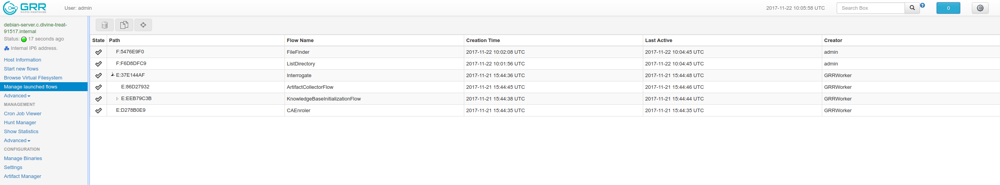

# GRR Flows

When designing GRR, one of the main goals was achieving great
scalability. One of the main resource hogs with the client-server model
is that while a client is active all resources that might have been
needed on the server side to communicate with it and do processing are
held (think temporary buffers, sockets, file descriptors...​). Even when
the client itself is doing operations that take time such as heavy
computations or waiting on I/O, resources are held on the server.

When trying to deal with thousands of clients at the same time, this
would translates into the server hoarding many unneeded resources.

To solve the resource hogging problem, Flows were created. Flows are the
server-side code entities that call client actions. These calls are done
asynchronously. That is, they are requested and their results become
available later on. Flows are like a state machine, where transition
between states happens when the results of client actions return to the
server. So here’s what happens when the GRR server launches a typical
Flow.

1.  The GRR server executes the initial Flow state.

2.  This state asks for one or more client actions to be performed on
    the client.

3.  The server clears all the resources this Flow has requested and
    waits for responses from the client to come back.

4.  When responses are received, the server fetches all the needed
    resources again and runs the Flow state where it expects these
    responses. If more client actions are requested by this state it
    goes back to step 2. Otherwise...

5.  The results of this Flow are stored and the flow state is updated.

Flows have a second very interesting property. For flows that make use
of some of the most primitive client actions, because all of the logic
is encapsulated on the server side and the client doesn’t have any state
at all, they naturally survive reboots while processing is taking place.

In the GRR UI, while having selected a client in the GUI, clicking on the *Manage launched flows* link on the left panel takes you to a view
that shows all the Flows that have been requested on this client.

The table view shows the current state of the flow, what’s the flow identifier (*Path*), the name of the Flow launched, the date when it was launched, when it was last active and who created it.

As you can see, a couple of Flows have been launched in the shown example:

1.  *CAEnroler*. This is the first flow ever to launch for any client.
    It is the enroling Flow which gets the client set up server side.

2.  *Interrogate*. After enroling, a client sends some information about
    the machine it’s running in such as the hostname, MAC address or
    users available on the system. This is the flow that fetches this
    information and if you remember the *Host Information* option, most
    information is contained there.

    This flow has also a few subflows shown in the table - flows can call other flows to collect more information from the client.

3.  *ListDirectory*. A Flow that lists the contents of a directory. This
    is what happened when the refresh button was pressed on the GUI.

4.  *FileFinder*. This flow is used to download and list files on the client machine.

Let’s see the *ListDirectory* flow in detail. You can click on any flow
to get detailed information.

There’s a lot of information here. Some bits worth mentioning are:

- Flow *state*, which tells us whether it finished correctly (oddly named **TERMINATED**) or not (**ERROR**), or if it’s still running (**RUNNING**).
- *Arguments* show the arguments this flow was started with.
- In *Context* there is information about resource usage of the flow and metadata about how many messages were sent back and forth to the client.
- *State Data* shows internal server side state of this flow. This information is mostly useful for debugging.

The other tabs shown on the flow details view are

- *Requests*. Show what pending requests this flow is waiting for while it's running. Mostly for debugging.
- *Results*. The results returned by this flow. More information in [Working with Results](working-with-results.md).
- *Log*. The log for this flow.
- *Api*. This tab shows how the flow can be started automatically using the GRR API. See the [Chapter on Automation](../automation-with-api.md).