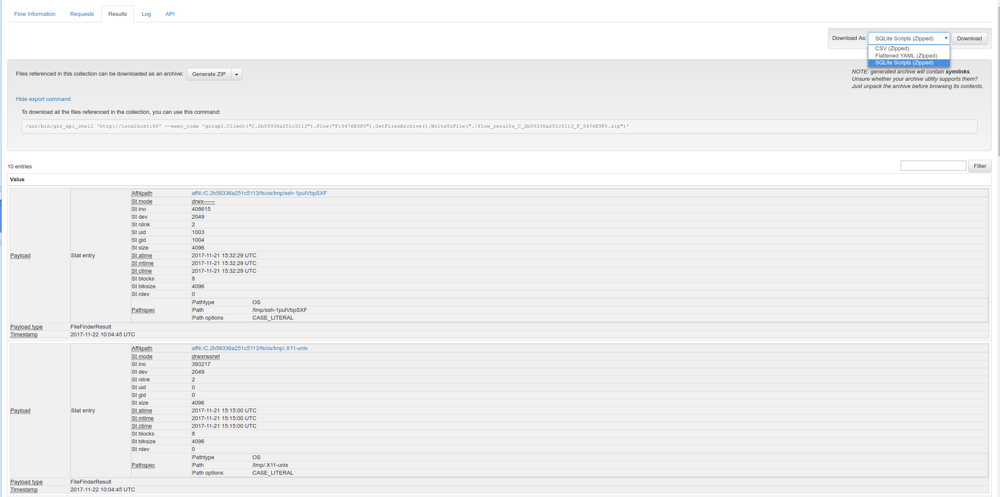

# Working with Flow results

All flows in GRR produce a list of (0 or more) results. For example in the image below, the results for a FileFinder flow are shown. The type of the items in the list is *FileFinderResult* which are essentially Stat entries that also reference collected files in case the file finder was also downloading the files from the client to the GRR server.

GRR only provides rudimentary analysis functionality for results. Results can be filtered using the filter input on the right which does a full text match for results (including all metadata fields) but in many cases it's better to export the results and use external analysis tools instead.

GRR offers to download the results in three different formats (the `Download As:` dropdown on the right:

- CSV
- YAML
- SQlite

**NOTE** All those formats will flatten the data, i.e., you might lose some information. In most cases this does not make a difference but it's good to be aware that this happens.

## Files ##

In the case where the results contain items that reference files (StatEntry for example), another option will be shown that allows the download of the referenced files as a ZIP or TAR archive. Additionally, GRR shows an export command that can be pasted into a GRR API shell and will download the same ZIP file programmatically using the GRR API.

