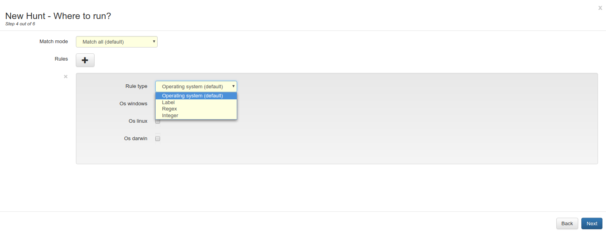

# Hunt Rules #

Hunt rules are used to define a subset of the clients to run a hunt on. The most common rules are
- Limiting the hunt to a single operating system and
- Limiting the hunt to clients that have a certain label attached

but GRR offers also regex and integer matching on all client attributes so more sophisiticated hunt rules can be created.

The rule section of the New Hunt Wizard can be seen in the following image:

GRR allows to specify more than one rule for hunts. By default, those rules are evaluated using a logical AND, meaning a client will only run the hunt if it satisfies all the conditions specified by every rule. This behavior can be changed with the dropdown on top, changing

- Match all (logical AND)

to

- Match any (logical OR)
