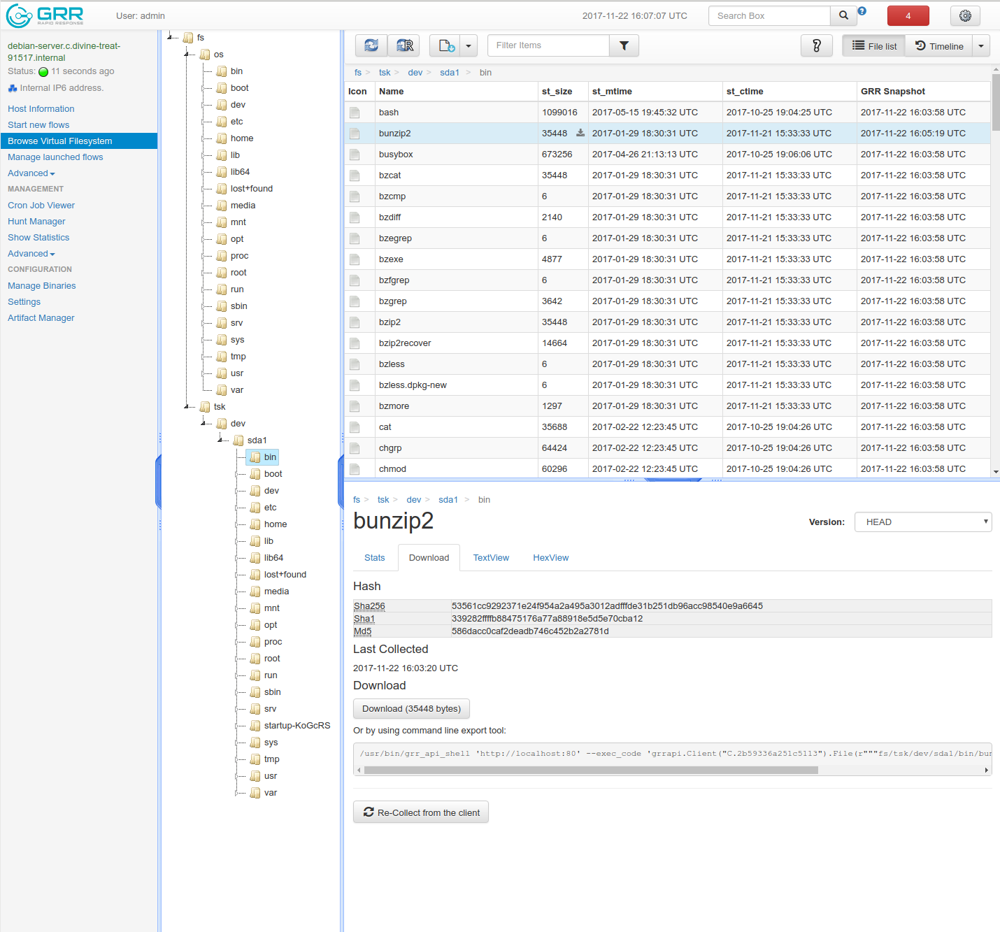

# Virtual File System

Every time GRR collects forensics information (files, Registry data, ...) from a client, it stores it server side in the data store. This information is presented to the analyst in a unified view we call the Virtual Filesystem view (menu item *Browse Virtual Filesystem*).

A screenshot is shown below ([larger Image](https://github.com/google/grr-doc/raw/markdown-new/docs/images/vfs_full.png)).

### VFS Tree ###

On the left there is a tree navigator. The most important top level items are:

- *fs* This gives a view of the client's filesystem.
- *fs/os* Under fs/os, GRR maps all the files it collected on a client *using the OS apis*, i.e., standard file manipulation system calls. Under fs/os, GRR shows everything that is mounted under / for Linux and Mac clients, for Windows clients, under fs/os there are entries like C: for each disk present on the client system.
- *fs/tsk* GRR also uses The Sleuth Kit (TSK) to open disks and images in raw mode and parsing the file systems on them. Every file collected in that way will be presented under fs/tsk. The first level under fs/tsk will be a raw disk, for example sda1 for Linux or \\\\?\Volume{5f62dc05-4cfc-58fd-b82c-579426ac01b8} for Windows.
- *registry* Only present for Windows machines, this branch gives a view into the live registry on the client machine. The first level after /registry are hives, HKEY_LOCAL_MACHINE or HKEY_USERS for example.

Note how in the screenshot, the folders under /fs/tsk and /fs/os actually reference the same folder on disk ("/"). However, there is an additional folder startup-KoGcRS that is only visible when using TSK, it gets filtered by the operating system API.

