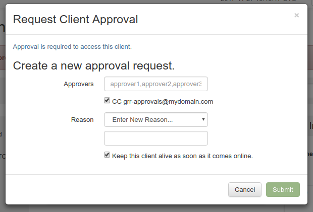
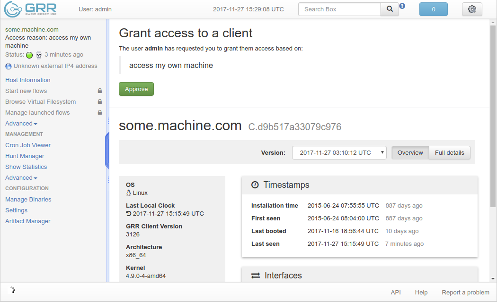

# Approval-based workflow

GRR has support for an approval-based access control system. To turn it on, set the *API.DefaultRouter* configuration option in the server configuration (see [API routers documentation](../maintaining-and-tuning/user-management/limiting-access-with-routers.md) for more details):

``` yaml
API.DefaultRouter: ApiCallRouterWithApprovalChecks
```

Approval-based workflow places certain restrictions on what users can do without getting an explicit approval from another user.

## Actions that **don't require** an approval

1. Searching for clients.
1. Getting information about a client host (including the history).
1. Looking at the list of hunts.
1. Looking at hunt results, logs and other related data.
1. Looking at cron jobs.


## Actions that **do require** an approval

1. Browsing client's Virtual File System.
1. Inspecting client's flows.
1. Starting new flows on a client.
1. Starting a new hunt (**NOTE**: this is a special case - starting a hunt requires an approval from an [admin user](user-management/authentication.md)).
1. Downloading files collected by a hunt.
1. Starting a new cron job.

## Requesting an approval

Whenever you try to perform an action that requires an approval in the GRR web UI, you'll see a popup dialog similar to this one:



You need to fill-in a comma-separated list of approvers. Each approver will get a notification about a pending approval request in their GRR web UI.

You can also select *CC* option to send an email to a predefined email address. This helps if you have multiple possible approvers and they're all subscribed to the same mailing list. *CC* option will only work if you have a proper [Email Configuration](email-configuration) in your GRR server config.

For every approval you also need to enter a reason you request one. This is done for auditing purposes. Also, when you access a client that you have an approval for, you'll see the reason displayed in GRR web UI's top left corner.

## Granting an approval

Whenever somebody requests an approval, you'll get a notification in the GRR web UI: the notification button in the top right corner will turn red and display a number of pending notifications.

When you click on a *Please grant access to <...>* notification, you'll see an approval request review page similar to this one:



You can see the approval request reason on the review page and also some details about the object that the requestor is trying to access (a client, a hunt or a cron job). If you find the approval request justified, you click on the "Approve" button. The requestor will receive a notification then stating that the access was granted.
