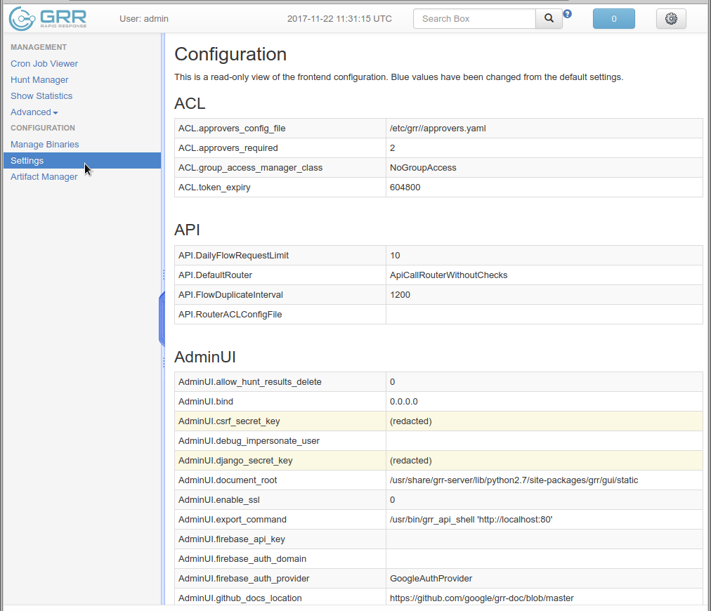

# Configuration file organization

When GRR is installed on a system, a system wide, distribution specific, configuration file is also installed (by default `/etc/grr/grr_server.yaml`). This specifies the basic configuration of the GRR service (i.e. various distribution specific locations). However, the configuration typically needs to be updated with site specific parameters (for example new crypto keys, the `Client.control_urls` setting to allow the client to connect to the server etc.)

In order to avoid having to trash the user customized configuration files when GRR is updated in future, we write site specific configuration files into the `Config.writeback` location (by default `/etc/grr/grr.local.yaml`). This local file only contains those parameters which are changed from the defaults, or the system configuration file.

> **Note**
>
> The system configuration file is never modified, all updated configurations are always written to the writeback location. Do not  edit the system configuration file as changes in this file will be  lost when GRR is upgraded.

You can see all available configuration options and their current values in the "Settings" pane in GRR's web UI.

