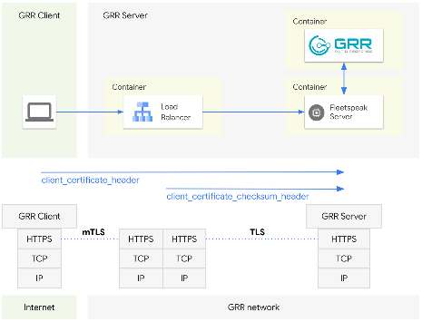

# Running GRR and Fleetspeak with Envoy in a Docker Compose sandbox

The following diagram shows the high level architecture of the sandbox environment.



This sandbox uses [Docker Compose](https://docs.docker.com/compose/) to demonstrate how to run [GRR](https://github.com/google/grr) and [Fleetspeak](https://github.com/google/fleetspeak) with [Envoy](https://www.envoyproxy.io/) as one of several of Fleetspeak's frontend modes.  
The sandbox also features the sample configurations that can be used to learn about Fleetspeak's frontend mode options and how to model your own configurations.  
Fleetspeak offers several other frontend modes. You can find more information about them in the [Fleetspeak repository](https://github.com/daschwanden/fleetspeak/docs/sandboxes.md). 

Before you begin you will need to install the sandbox environment.

## Setup the sandbox environment
- [Install Docker](#install-docker)
- [Install docker compose](#install-docker-compose)
- [Install Git](#install-git)
- [Clone the GRR Doc repository](#clone-the-grr-doc-repository)
- [Create Configurations](#create-configurations)
- [Build test app](#build-test-app)

## Run the GRR Fleetspeak sandbox demo
```
docker compose up --build -d
```
When you run the sandbox for the first time Docker will have to build the containers before running them.
This will take a couple of minutes so you might want to grab a cup of coffee now.  
The next runs will be a lot faster.  

## Connect to the GRR UI
Once the containers are up and running you can connect to the GRR UI.
You will have to create a ```demo``` user first. The script will ask you for a password. We suggest you use ```demo``` for simplicity.
```
docker exec -it grr-compose-grr-admin-1 /grr/venv/bin/grr_config_updater add_user demo
```
With the ```demo``` user in place you can now point your browser to the GRR UI: [http://localhost:8000](http://localhost:8000)

## Stop the GRR Fleetspeak sanbox demo
```
docker compose down
```

## Setup instructions

### Install docker
Ensure that you have a recent versions of ```docker``` installed.

You will need a minimum version of ```19.03.0+```.

Version ```20.10``` is well tested, and has the benefit of included ```compose```.

The user account running the examples will need to have permission to use Docker on your system.

Full instructions for installing Docker can be found on the [Docker website](https://docs.docker.com/get-docker/).  

### Install docker compose
The examples use [Docker compose configuration version 3.8](https://docs.docker.com/compose/compose-file/compose-versioning/#version-38).

You will need to a fairly recent version of [Docker Compose](https://docs.docker.com/compose/).  

### Install Git
The Fleetspeak project repository is managed using [Git](https://git-scm.com/).

You can [find instructions for installing Git on various operating systems here](https://git-scm.com/book/en/v2/Getting-Started-Installing-Git).  

### Clone the GRR Doc repository
If you have not cloned the GRR Doc repository already, clone it with:

```
git clone https://github.com/google/grr-doc
```

### Create configurations

```
cd grr-doc/fleetspeak/sandbox
./createConfig.sh
```
