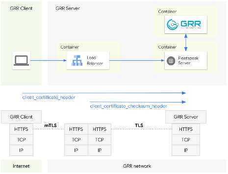

# Running GRR and Fleetspeak with Envoy

The following diagram shows the high level architecture of the sandbox environment.



This sandbox uses [Docker Compose](https://docs.docker.com/compose/) to demonstrate how to run [GRR](https://github.com/google/grr) and [Fleetspeak](https://github.com/google/fleetspeak) with [Envoy](https://www.envoyproxy.io/) leveraging Fleetspeak in the HTTPS header frontend mode.  
This frontend mode lends itself to showcase an example of Fleetspeak's more involved frontend modes.  
Fleetspeak offers several other frontend modes to run GRR/Fleetspeak in varying contexts. You can find more information about them in the [Fleetspeak repository](https://github.com/google/fleetspeak/docs/sandboxes.md).   

The sandbox also features the sample configurations that can be used to learn about Fleetspeak's frontend mode options and how to model your own configurations.  

Before you begin you will need to setup the sandbox environment.
It is important that you follow all the steps in the [setup instructions](#setup-instructions) section before running the sandbox.

## Setup the sandbox environment
- [Follow the "Install * " instructions for GRR](../../installing-and-running-grr/via-docker-compose.md)
- [Clone the GRR Doc repository](#clone-the-grr-doc-repository)
- [Create Configurations](#create-configurations)

### Clone the GRR Doc repository
If you have not cloned the GRR Doc repository already, clone it with:

```
git clone https://github.com/google/grr
```

### Create configurations

```
cd grr-doc/installing-and-running-grr/advanced-usecases/sandbox
./createConfig.sh
```

## Run the GRR Fleetspeak sandbox demo
```
docker compose up --build -d
```
When you run the sandbox for the first time Docker will have to build the containers before running them.
This will take a couple of minutes so you might want to grab a cup of coffee now.  
The next runs will be a lot faster.  

## Connect to the GRR UI
Once the containers are up and running you can connect to the GRR UI.
You will have to create a ```demo``` user first. The script will ask you for a password. We suggest you use ```demo``` for simplicity.  

You can create the ```demo``` user by executing the command listed in the box below.
```
docker exec -it sandbox-grr-admin-1 grr_config_updater add_user demo --secondary_configs /config/grr-server/server.local.yaml
```
With the ```demo``` user in place you can now point your browser to the GRR UI: [http://localhost:8000](http://localhost:8000)

## Stop the GRR Fleetspeak sandbox demo
```
docker compose down
```
