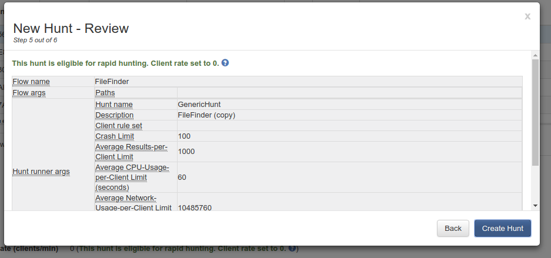

# Rapid hunts

Rapid hunting is a GRR UI feature that automatically sets *client rate* to 0 for certain types of hunts, thus making such hunts much faster.

## Enabling rapid hunts

Add the following to GRR server configuration file:

```yaml
AdminUI.rapid_hunts_enabled: True
```

## Rapid hunts UI

When rapid hunts are enabled, hunts creation wizard shows an eligibility note on its *Review* page.



If a hunt is deemed rapid hunting eligible, its *client rate* is set to 0 automatically. User can still override it to a non-0 value, if needed.

There's also an additional eligibility note on a *Hunt Overview* page.

## Rapid hunting eligibility

A hunt should meet following conditions to be considered rapid-hunting eligible:

 1. It should be a *FileFinder* or *ClientFileFinder* hunt.
 1. Action should be *STAT* or *HASH* (but not *DOWNLOAD*).
 1. Each glob expression can have **at most** one wildcard in it. For example, `/foo/bar/*` is ok, but `/foo/*/bar/*` is not.

NOTE: if approvals are turned on, rapid hunts would still need to be approved.

