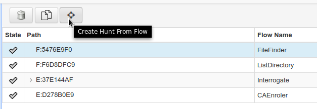

## Creating a Hunt

### Manual Hunt Creation ###

You can create a new Hunt in the Hunts section of the UI. To
create a Hunt:

1. Click the + button

2. Select a flow you want to run and fill out all parameters as you would do for a flow running on a single client.

3. The second page of the Hunt Wizard lets you set hunt parameters. They are:

    - *Hunt Description* A friendly name for this hunt to show in the UI.
    - *Client Limit* A limit on the number of clients this hunt should run on. This can be changed later so it makes sense to start the hunt on a few clients first (we like 100) to see how it goes and only later remove the limit.
    - *Crash Limit* If more clients than indicated in this parameter return an error, the hunt is automatically paused.
    - *Expiry Time* Hunts are never really done since new clients might appear at any time and they should run the hunt too. This time indicates the lifetime of a hunt after which it is considered done.
    - *Client Rate* Number of clients to schedule the hunt on per minute. The default of 20 we have found to be safe, avoiding overloading the server for intensive hunts with lots of message passing (e.g. multiple flows, lots of results). A value of 0 disables rate limiting and clients will be scheduled as fast as possible. Use this with care: light hunts you need to run quickly.
    - Some more advanced options are available behind the advanced link but they should not need adjustment in most cases.

3.  Set any output plugins, such as receiving an email for each result.

5.  Set Hunt Rules. Most commonly this is used to select a specific platform target, e.g. Windows. See the [Rules section](rules.md).

6.  Click Run

Unless approvals are required, you can start the hunt immediately.

### Creating a Hunt from a Flow ###

Manual hunt creation is a bit dangerous because mistakes happen and they can propagate to many machines in short time. A better way of creating a hunt is to copy an existing and tested flow. In order to do so, create a flow on a client with the parameters you want to hunt for and make sure that it works. Once you are convinced that this flow is what you want to run on the fleet, use the "Create Hunt from Flow" button in the Manage launched flows view:

This will copy all flow parameters to a new hunt and you can continue to set all Hunt parameters starting from Step 3 above.
