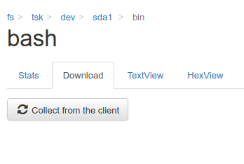
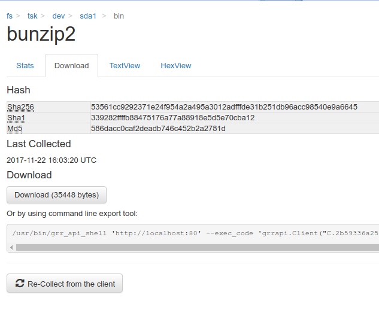
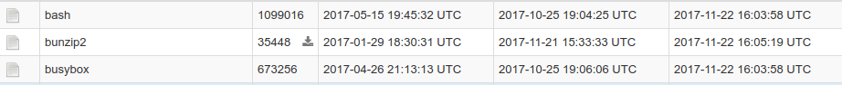

# Navigating the VFS #

Using the tree navigator, an analyst can look at all the files / registry values *that GRR has already downloaded from the client*. This is important to note, the view only shows what the server has stored for the client machine, not the current state. Sometimes this means that directories or Registry keys show up empty but not because there are no keys / values but just because the corresponding information has never been collected.

In order to populate the VFS, there are two buttons that trigger collection of more information:

The left button triggers a refresh of the current branch of the VFS with data collected from the client - similar to listing a directory. GRR automatically figures out which kind of data is currently displayed (OS based files, TSK based files, Registry information) and schedules the corresponding collection action.

The button marked with an R schedules a recursive refresh.

> **Note** that recursive refrehses with a large depth might impact the client and GRR system.

## Looking at Files ##

In the file detail view, GRR always shows Stat information about the file:

Note that there is a version dropdown on top of this page and all data is timestamped. Whenever GRR collects information from a client machine, it just creates a new version of the stored object in the database, old information is never overwritten. This is why it's always possible to go back in the GRR DB and look at previously collected data - both metadata and contents - by simply selecting an earlier version.

Often, GRR knows about the file but has not collected any contents yet. In the download tab there is an option to collect the file from the client:

Again, GRR will collect the file the correct way (OS or TSK) automatically. Once the file is available, the same download view will have options to download the file to the analysts machine. Basic text and hex views are also provided.

In the tree view, files with actual contents stored in GRR will have a small downloaded icon next to the size information. In this screenshot, bunzip2 is the only file with data collected:

### Bulk Downloading of Files ###

GRR offers the option to conviniently download all files collected from a client for offline analysis. The button

can be used to

- Download all files with data in the current directory and below or
- Download all files with data ever collected from that client

as a zip archive. The drop down choses between the two options.
