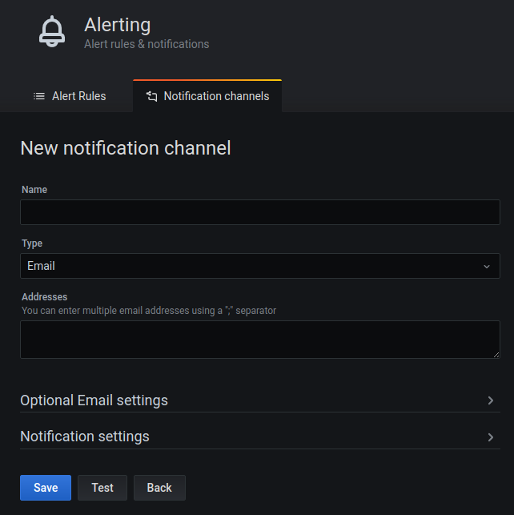

# Monitoring
This page outlines how to set up monitoring for the GRR components and
for Fleetspeak. GRR and Fleetspeak keep track of many metrics which
can be used to create charts about their performance, health,
and workload.

When `Monitoring.http_port` is configured, each GRR component exports
metrics at `http://<host>:<port>/metrics`. The export is human-readable
plain-text and follows the [Open Metrics standard](https://openmetrics.io/).
More importantly however, [Prometheus](https://prometheus.io) can parse the metrics,
and [Grafana](https://grafana.com/) can plot the parsed data.


## Prometheus Setup
This example will walk you through a basic Prometheus setup.
For this example, the GRR Frontend, Worker, and Admin UI will be
launched on your local machine. You can also choose to monitor
Fleetspeak servers; otherwise feel free to skip the relevant steps, which are
marked as **FS**.

1. Install GRR, for example from
[pip](../installing-grr-server/from-released-pip.md).

1. Run the GRR components locally. Execute each of the
three commands in a separate terminal:

    ```bash
    # Fleetspeak monitoring is configured in a separate config file.
    grr_server --component fleetspeak_server

    grr_server --component admin_ui -p Monitoring.http_port=44451
    
    grr_server --component frontend -p Monitoring.http_port=44452
    
    grr_server --component worker -p Monitoring.http_port=44453
    ```
    
    Note: Custom monitoring port assignment is only required because the
    ports would clash when running multiple GRR components on one machine.
    Prometheus requires to know which type of component listens on which
    ports. If you use `Monitoring.http_port_max`, make sure that only one
    type of GRR components (e.g. only workers) listen on a given
    range of ports.

1. **FS:** Edit the file `server.components.config`. It is located in
`/etc/fleetspeak-server` on a setup installed from a DEB and in the virtualenv,
in `fleetspeak-server-bin/etc/fleetspeak-server` when running from a
virtualenv.  Add the following to the end of the file:

    ```bash
    stats_config: <
      address: "localhost:54451"
    >
    ```
    This will insure that Fleetspeak will export its metrics to Prometheus
    in [http://localhost:54451/metrics](http://localhost:54451/metrics).

1. Open [http://localhost:44451/metrics](http://localhost:44451/metrics)
in your browser. You should see a plain-text list of metrics.

1. [Install Prometheus](https://prometheus.io/docs/prometheus/latest/getting_started/),
e.g. by downloading and unpacking the archive file.

1. Configure Prometheus to scrape GRR. Save the following configuration
as `prometheus.yml` in the Prometheus folder.
    ```yaml
    global:
      scrape_interval: 15s
     
    scrape_configs:
      - job_name: 'grr_admin_ui'
        static_configs:
        - targets: ['localhost:44451']
    
      - job_name: 'grr_frontend'
        static_configs:
        - targets: ['localhost:44452']
    
      - job_name: 'grr_worker'
        static_configs:
        - targets: ['localhost:44453']
      ```

1. **FS:** under `scrape_configs` also add the following:
    ```yaml
    - job_name: 'fleetspeak'
      static_configs:
      - targets: ['localhost:54451']
    ```

1. Start Prometheus, by running the following command from the
Prometheus folder:
    ```bash
    ./prometheus --config.file=prometheus.yml
    ```

1. Open [http://localhost:9090/targets](http://localhost:9090/targets)
in your browser. After a couple seconds, you should see three
(**FS:** four) targets (`grr_admin_ui`, `grr_frontend`, `grr_worker`),
each having 1 instance up.

1. Open the Expression Browser by clicking on Graph
([http://localhost:9090/graph](http://localhost:9090/graph)).
On this page, click on the Graph tab (next to Console). Then, try any
of the example queries to query GRR metrics. Be aware that you might only
see very few data points, very low values, or no data at all since GRR
is not under any real workload and has 0 connected clients in this example.

1. At this point, you can use Prometheus to display basic charts using the
[expression browser](https://prometheus.io/docs/visualization/browser/).
We recommend the usage of a dedicated visualization software, e.g.
[Grafana](https://prometheus.io/docs/visualization/grafana/).
You can set up a quick configuration of Grafana to scrape the
metrics from Prometheus by
[setting up Grafana](#grafana-setup).


### Example Queries
To get you started, this page contains some example queries. These queries
give you a good insight on GRR's health and workload.

#### QPS rate for the Frontend
```
rate(frontend_request_count_total{job="grr_frontend"}[1m])
```

#### Latency for requests to the Frontend
```
rate(frontend_request_latency_sum{job="grr_frontend"}[5m]) /
rate(frontend_request_latency_count{job="grr_frontend"}[5m])
```

#### Active Tasks running on the Frontend
```
frontend_active_count
```

#### Rate of successful flows on the Worker
```
rate(grr_flow_completed_count_total{job="grr_worker"}[5m])
```

#### Rate of failed flows on the Worker
```
rate(grr_flow_errors_total{job="grr_worker"}[5m])
```

#### Threadpool latency in the Worker
```
rate(threadpool_working_time_sum{job="grr_worker"}[5m]) /
rate(threadpool_working_time_count{job="grr_worker"}[5m])
```

#### Threadpool queueing time in Worker
```
rate(threadpool_queueing_time_sum{job="grr_worker"}[5m]) /
rate(threadpool_queueing_time_count{job="grr_worker"}[5m])
```

#### Number of outstanding tasks in the Worker
```
threadpool_outstanding_tasks{job="grr_worker"}
```

#### Number of threads running on the Worker
```
threadpool_threads{job="grr_worker"}
```

#### Rate of client crashes reported to the Worker
```	
rate(grr_client_crashes_total{job="grr_worker"}[5m])
```

### Scaling Prometheus
Prometheus supports automatic
[Service Discovery](https://prometheus.io/docs/prometheus/latest/configuration/configuration/)
for many types of infrastructure. Depending on your hosting
setup and size of your GRR installation, this can be an
improvement over manually hardcoding hostnames in the Prometheus configuration.

### Prometheus Security Considerations
A minimal HTTP service, based on
[prometheus_client](https://github.com/prometheus/client_python/)
is listening at `Monitoring.http_port` for each GRR component. This HTTP
service exports read-only metrics under `/metrics` and `/varz` and does
**not enforce any access control**. People with access to it can read
aggregated metrics about your GRR installation. With these metrics, facts
about the number of workers, flow activity, and service health can be
derived. Make sure to limit access to the port, for example by employing
a firewall. Furthermore, read [Prometheus Security](https://prometheus.io/docs/operating/security/).

## Grafana Setup
This example will walk you through setting up Grafana as a dedicated
visualization software to parse, display and query metrics scraped from
GRR server components by Prometheus. If you've followed the
[example setup](#prometheus-setup) before, then Prometheus is configured to scrape
GRR (and Fleetspeak as well if you have a Fleetspeak-based deployment). You will also be able to
set up a simple alerting system using Grafana. These instructions assume that
GRR server and Prometheus are both up and running.

1. [Install Grafana](https://grafana.com/docs/grafana/latest/installation/debian/)
by following the instructions:
    ```
    sudo apt-get install -y apt-transport-https
    sudo apt-get install -y software-properties-common wget
    wget -q -O - https://packages.grafana.com/gpg.key | sudo apt-key add -

    sudo add-apt-repository "deb https://packages.grafana.com/oss/deb stable main"

    sudo apt-get update
    sudo apt-get install grafana
    ```

    This will install the latest OSS release.

1. After Grafana is installed, you can
[start the Grafana server](https://grafana.com/docs/grafana/latest/installation/debian/#2-start-the-server)
by executing in a terminal (assuming your operating system either
Debian or Ubuntu and you installed the latest OSS release):
    ```
    sudo systemctl daemon-reload
    sudo systemctl start grafana-server
    sudo systemctl status grafana-server
    ```
    
    This will get the Grafana server up and running on `http://localhost:3000`.

1. Grafana is now set up and can be visited at `http://localhost:3000`.
The username and password should be "admin"; please change it.
If the Grafana UI doesn't show up, either the
[installation of Grafana](https://grafana.com/docs/grafana/latest/installation/#install-grafana)
or the [server run](https://grafana.com/docs/grafana/latest/installation/debian/#2-start-the-server)
failed; make sure to check the official documentation.

1. [Set up Prometheus as a data source](https://grafana.com/docs/grafana/latest/features/datasources/prometheus/#prometheus-data-source)
for Grafana, so that Grafana can display the metrics from Prometheus.
To do that, follow the
[these instructions](https://grafana.com/docs/grafana/latest/features/datasources/add-a-data-source/#add-a-data-source):
Click on Configuration -> Data Sources in the Grafana server UI, then click
on the "Add data source" button. From the list of "time series databases", choose
Prometheus and in the Name field type `grr-server`.

1. Grafana is set up and ready to show metrics scraped by Prometheus. You
can start by either
[creating your own dashboards](https://grafana.com/docs/grafana/latest/getting-started/getting-started/#create-a-dashboard)
or [importing exisiting dashboards](https://grafana.com/docs/grafana/latest/reference/export_import/#importing-a-dashboard)
into Grafana.
The next step would be to import dashboards provided with GRR from the
[Grafana folder in GRR repository](https://github.com/google/grr/tree/master/monitoring/grafana). 
You can customize and expand them with additional graphs, if needed.
These dashboards contain some example graphs of
metrics scraped by Prometheus, and also implement sample alerts. To do that,
first download the dashboards from the repository (download dashboards from
[`fleetspeak_enabled_setup/dashboards_for_use`](https://github.com/google/grr/tree/master/monitoring/grafana/grr_grafanalib_dashboards/fleetspeak_enabled_setup/dashboards_for_use)
or [`legacy_setup/dashboards_for_use`](https://github.com/google/grr/tree/master/monitoring/grafana/grr_grafanalib_dashboards/legacy_setup/dashboards_for_use),
depending on your deployment), and then head over to
`http://localhost:3000/dashboard/import`. There, you can click 'Upload
.json file' and upload the dashboard you have downloaded from the repository.
The dashboard is now imported; you can access it by going to
`http://localhost:3000/dashboards` and clicking the dashboard's name, e.g
"Frontends Dashboard". Each of the sample dashboards correspond to a
different component of GRR server (and Fleetspeak server itself), e.g
the Frontends Dashboard shows aggregated metrics from all Frontends
that are active in GRR server. Each of the dashboards contain several
panels; each such
[panel](https://grafana.com/docs/grafana/latest/panels/panels-overview/#panel-overview)
consists of a graph that contain one or more metrics queried from Prometheus,
and possibly alerting rules.

1. You can now use the dashboards. The dashboards can give a general
overview over the main components of the GRR server and Fleetspeak
servers, which can be utilized by the user to monitor different metrics
of each component. Examples for such metrics can be found in the
[examples above](#example-queries).
Remember that the dashboards and alerts are flexible, and can be
expanded or modified to adjust to your exact needs. Additional metrics
can be used by exploring `http://<host>:<port>/metrics` for each
component of GRR server (change the port according to the GRR server
component you want) and Fleetspeak servers, and if you'd like to
create your own
[custom dashboards](https://grafana.com/docs/grafana/latest/getting-started/getting-started/#create-a-dashboard),
[panels](https://grafana.com/docs/grafana/latest/panels/add-a-panel/#add-a-panel)
and [alerts](https://grafana.com/docs/grafana/latest/alerting/create-alerts/#create-alerts),
make sure to go over the corresponding documentation in Grafana.

### Alerts

If you want to use the alerts in Grafana, you first need to define a
[notification channel](https://grafana.com/docs/grafana/latest/alerting/notifications/#alert-notifications)
for the alerts. This can be done by heading over to
`http://localhost:3000/alerting/notification/new` and
[following the form](https://grafana.com/docs/grafana/latest/alerting/notifications/#new-notification-channel-fields)
to add a notification channel. For reference, check out the screenshot
that follows.
Once a notification channel is set up,
you will start receiving alerts from the existing dashboards, as those
contain definitions for simple alerts. There are two sample alerting
rules: in each dashboard, there is a panel that counts the number of
active processes for the specific job. For example, in the Workers
dashboards, there is a panel called "Active Processes" which shows
the current number of active Workers processes. If the number of active
workers is zero - an alert will be fired. If you want to disable or
remove an alert, go to the dashboard and the corresponding panel,
and there you can remove the alerting rule.


### Monitoring Client Load Stats

Using Grafana, you are able to view statistics of individual GRR
clients and monitor them. To achieve this, check out the following
steps.

* Note that this is only applicable to Fleetspeak-based GRR deployments,
as the individual client data using these steps is gathered from the
underlying Fleetspeak client, unlike the current GRR Admin UI which
gathers its client data from the GRR clients instead.

1. [Set up Grafana](#grafana-setup),
until at least step 3. At this point, you should have a running
instance of Grafana server.

1. Run GRRafana HTTP server by `grr_server --component grrafana`.
Briefly, this server is a component of GRR which serves Grafana clients'
stats data from GRR, through the gRPC connection between GRR and
Fleetspeak. For more details, check out
[google/grr#832](https://github.com/google/grr/pull/832). It should
run by default on port 5000.

1. [Install JSON Datasource plugin](https://github.com/simPod/grafana-json-datasource#installation)
by using the command: `grafana-cli plugins install simpod-json-datasource`.
The plugin will issue JSON requests from Grafana to the HTTP server,
and then display the queries' results. Make sure that the url is
`http://<host>:5000`, and for a more friendly name than 'JSON', feel
free to rename the data source to 'grrafana'.

1. After the server is up and running, if you do not want to create your
own Grafana monitoring dashboards for individual client monitoring, we got
you. In the
[sample dashboards in step 3](#grafana-setup), you
can also find a sample dashboard called Client Load Stats for this exact
purpose and import it as explained in
[step 5 here](#grafana-setup).

1. If you want, you can create
[Grafana dashboards](https://grafana.com/docs/grafana/latest/dashboards/#dashboard-overview)
or extend the [sample dashboards](https://github.com/google/grr/tree/master/monitoring/grafana/grr_grafanalib_dashboards/fleetspeak_enabled_setup/dashboards_for_use)
to query individual clients. To do that,
create a new dashboard (clicking on '+' -> Dashboard), then click on
Dashboard Settings on the top-right and add a new
[variable](https://grafana.com/docs/grafana/latest/variables/#templates-and-variables).
Name the new variable `ClientID` (this name must be precise, with
correct capitalization as well, in order for it to be identified
correctly) and specifiy its
[type](https://grafana.com/docs/grafana/latest/variables/variable-types/#variables-types)
as "Constant" (and make sure to not hide the variable or the label,
so that it's visible in the dashboard). At this point, you should
have an empty dashboard with an empty textbox named `ClientID` above
your panels. Feel free to create new panels and playing around with
all the individual statistics information** you can get from your
clients!

### Aggregated Clients Statistics

In GRR Admin UI you are able to view aggregated statistics for multiple GRR
clients, such as an OS breakdown, GRR version breakdown and so on. To see
those statistics, on GRR Admin UI, under the 'Management' section on the menu,
enter 'Statistics'. Similarly to
[Client Load Stats](#monitoring-client-load-stats),
you may choose to view this information using Grafana.

To achieve this, follow these steps:

1. Follow the steps in [Client Load Stats](#monitoring-client-load-stats)
until at least step 3. At this point, you should have a Grafana instance up
and running, the
[JSON Datasource plugin](https://github.com/simPod/grafana-json-datasource)
installed and configured, and the GRRafana HTTP server (as discussed in
[google/grr#832](https://github.com/google/grr/pull/832)) is up and running.

1. You can now fetch aggregated clients statistics, which are named on a similar
convention to the metrics gathered in the current GRR Admin UI, such as "OS
Release Breakdown - N Days Active" and so on. Note that we do not provide sample
dashboards for these metrics as they are table-based and cannot be manipulated
too much. Therefore, you can make a panel that consists of a single metric alone
by just selecting it on the dropdown box named "Metric" while creating the new
[Grafana panel](https://grafana.com/docs/grafana/latest/panels/panels-overview/#panel-overview).
